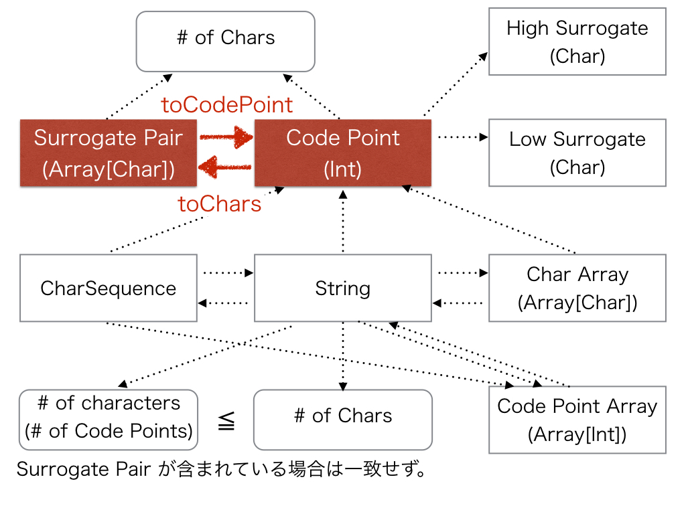
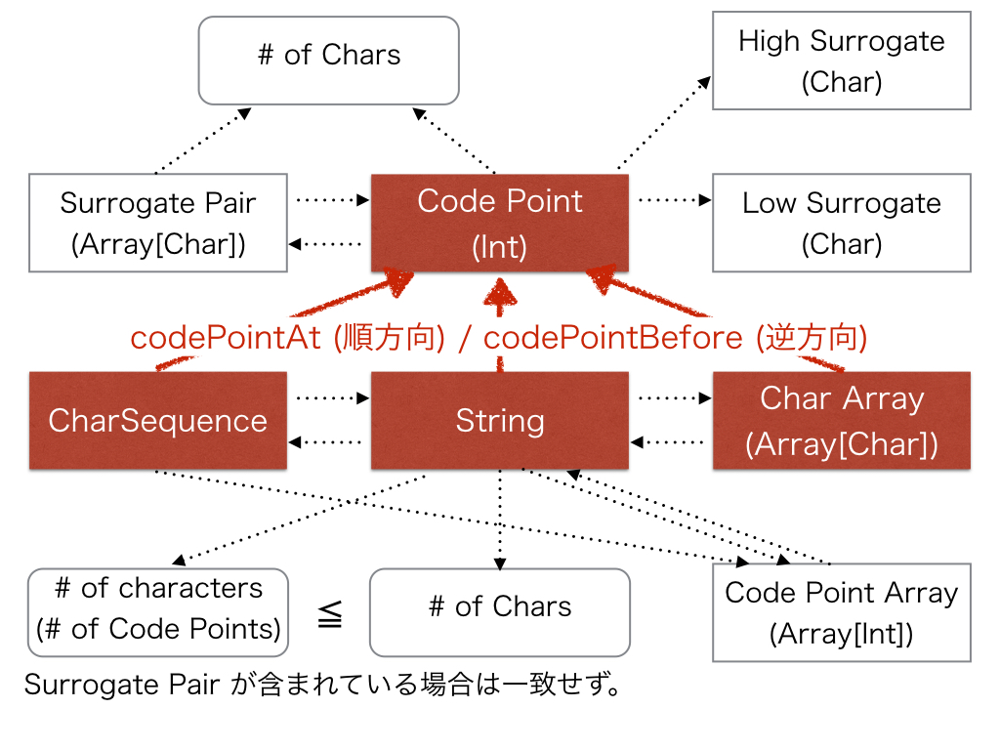
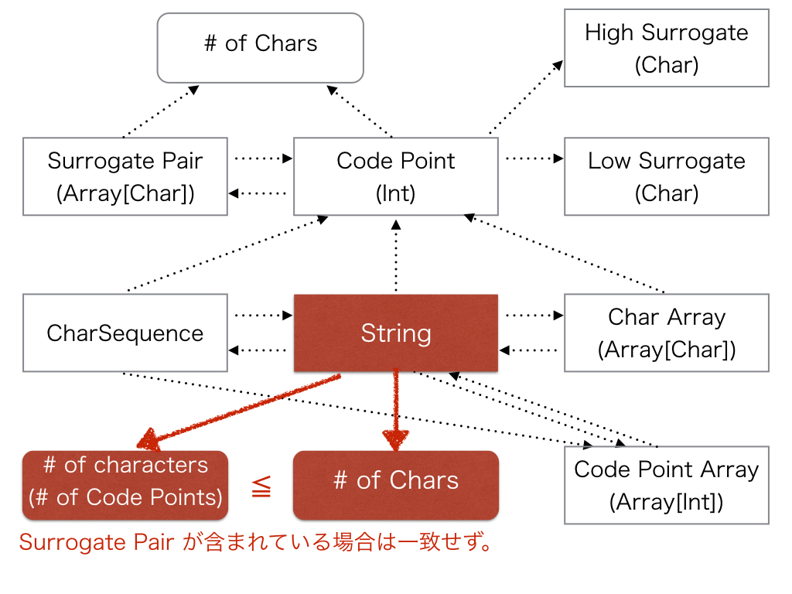
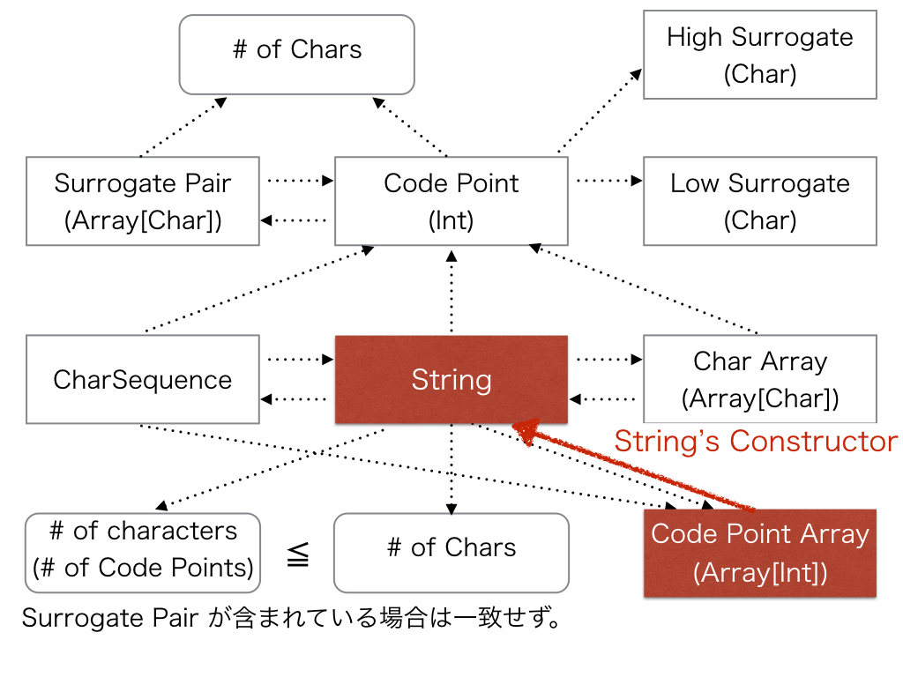
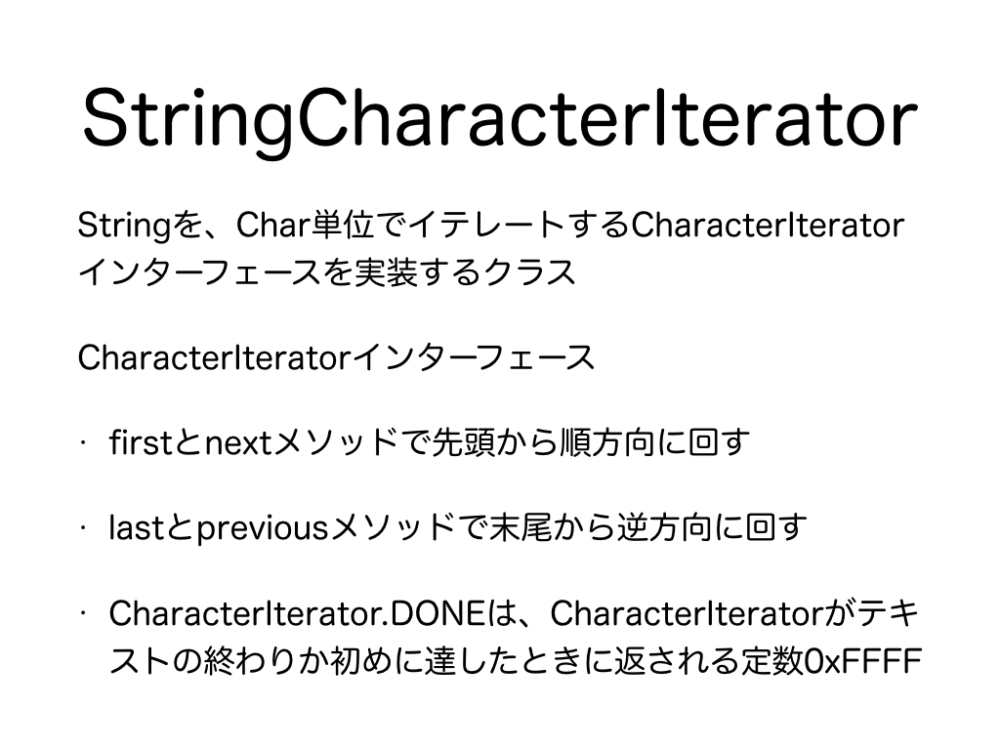

# 2.　コードポイントとサロゲートペアの実装

<h2>2.　コードポイントとサロゲートペアの実装</h2>
<br>
今日は、この表をインデックスとして使用し、メソッドを表す個々のリンクについて説明していきます。
***
<h3>2.1　サロゲートペア (Array[Char])とコードポイント (Int)の相互変換</h3>
<br>
コードポイントとサロゲートペアの変換方法について説明します。
<h4>2.1.1　サロゲートペア (Array[Char])からコードポイント (Int)への変換</h4>
Character.toCodePointメソッドがサロゲートペアからコードポイントへの変換メソッドです。
```scala
  @Test
  def testSurrogatePairToCodePoint(): Unit = {
    val high: Char = 0xD842
    val low : Char = 0xDFB7
    assert(Character.isHighSurrogate(high))
    assert(Character.isLowSurrogate(low))
    if (Character.isHighSurrogate(high) && Character.isLowSurrogate(low)) {
      val codePoint: Int = Character.toCodePoint(high, low)

      assert(codePoint == 0x20BB7)
    }
  }
```
<h4>2.1.2　コードポイント (Int)からサロゲートペア (Array[Char])への変換</h4>
Character.toCharsメソッドがコードポイントからサロゲートペアを表すChar配列、あるいはサロゲートペアで表されないCharを１つ含む配列への変換メソッドです。
```scala
  @Test
  def testCodePointToSurrogatePair1(): Unit = {
    val codePoint: Int = 0x20BB7
    assert(Character.isValidCodePoint(codePoint))
    if (Character.isValidCodePoint(codePoint)) {
      val charArray: Array[Char] = Character.toChars(codePoint)
      //IllegalArgumentException:
      //codePointが有効なUnicodeコードポイントではない場合発生

      assert(charArray.length == 2)
      assert(charArray.head == 0xD842)
      assert(charArray(1) == 0xDFB7)
    }
  }
```
```scala
  @Test
  def testCodePointToSurrogatePair2(): Unit = {
    val codePoint: Int = 0x20BB7
    val dst: Array[Char] = new Array(16)
    val index: Int = 8
    assert(Character.isValidCodePoint(codePoint))
    if (Character.isValidCodePoint(codePoint)) {
      //dst(index)またはdst(index)とdst(index + 1)に変換されたCharを代入し、代入したCharの個数を返す
      val size = Character.toChars(codePoint, dst, index)
      //IllegalArgumentException:
      //codePointが有効なUnicodeコードポイントでない場合発生
      //NullPointerException:
      //dstがnullの場合発生
      //IndexOutOfBoundsException:
      //codePointがBMP領域なら0 ≦ dstIndex < dst.length、Supplementary領域なら0 ≦ dstIndex < dst.length - 1に反した場合発生

      assert(size == 2)
      assert(dst(8) == 0xD842)
      assert(dst(9) == 0xDFB7)
    }
  }
```
***
<h3>2.2　コードポイント (Int)からChar数 (Int)の取得</h3>
<br>
コードポイントがいくつのCharで表されるのかを取得する方法について説明します。まずは、先ほどのように一度Charの配列に変換してしまう方法があります。
<br>
```scala
  @Test
  def testCodePointToNumOfChars1(): Unit = {
    val codePoint: Int = 0x20BB7
    assert(Character.isValidCodePoint(codePoint))
    if (Character.isValidCodePoint(codePoint)) {
      val charArray: Array[Char] = Character.toChars(codePoint)
      val length: Int = charArray.length
      //IllegalArgumentException:
      //codePointが有効なUnicodeコードポイントではない場合発生

      assert(length == 2)
    }
  }
```
<br>
次に、Character.charCountメソッドを使用して、直接コードポイントからいくつのCharで表されるのかを取得することができます。
```scala
  @Test
  def testCodePointToNumOfChars2(): Unit = {
    val codePoint: Int = 0x20BB7
    val countOpt: Option[Int] =
      if (Character.isValidCodePoint(codePoint)) {
        Option(Character.charCount(codePoint))}
      else {
        None
      }

    assert(countOpt.nonEmpty)
    if (countOpt.nonEmpty) {
      assert(countOpt.get == 2)
    }
  }
```
最後に、コードポイントがBMP領域にあるのか追加領域にあるのかを調べることで、いくつのCharで表されるのかを取得することができます。
```scala
  @Test
  def testCodePointToNumOfChars3(): Unit = {
    val codePoint: Int = 0x20BB7
    val countOpt: Option[Int] =
      if (Character.isBmpCodePoint(codePoint)) {
        Option(1)
      } else if (Character.isSupplementaryCodePoint(codePoint)) {
        Option(2)
      } else {
        None
      }

    assert(countOpt.nonEmpty)
    if (countOpt.nonEmpty) {
      assert(countOpt.get == 2)
    }
  }
```
***
<h3>2.3　コードポイント (Int)から上位サロゲート (Char)や下位サロゲート (Char)の取得</h3>
<br>
<h4>2.3.1　コードポイント (Int)から上位サロゲート (Char)の取得</h4>
コードポイントから上位サロゲートをCharacter.highSurrogateメソッドで取得できます。
```scala
  @Test
  def testCodePointToHighSurrogate(): Unit = {
    val codePoint: Int = 0x20BB7
    val high: Char = Character.highSurrogate(codePoint)

    assert(Character.isSurrogate(high))
    if (Character.isSurrogate(high)) {
      assert(Character.isHighSurrogate(high))
      if (Character.isHighSurrogate(high)) {
        assert(high == 0xD842)
      }
    }
  }
```
<h4>2.3.2　コードポイント (Int)から下位サロゲート (Char)の取得</h4>
コードポイントから下位サロゲートをCharacter.lowSurrogateメソッドで取得できます。
```scala
  @Test
  def testCodePointToLowSurrogate(): Unit = {
    val codePoint: Int = 0x20BB7
    val low: Char = Character.lowSurrogate(codePoint)

    assert(Character.isSurrogate(low))
    if (Character.isSurrogate(low)) {
      assert(Character.isLowSurrogate(low))
      if (Character.isLowSurrogate(low)) {
        assert(low == 0xDFB7)
      }
    }
  }
```
***
<h3>2.4　CharSequenceやStringやChar配列 (Array[Char])からコードポイント (Int)の取得</h3>
<br>
CharSequenceインターフェースを実装するオブジェクト、Stringオブジェクト、Char配列からコードポイントにcodePointAt/codePointBeforeメソッドを使用して変換できます。
codePointAtは順方向、codePointBeforeは逆方向に解析します。
<h4>2.4.1　指定インデックス (Int)にある文字のコードポイント (Int)の取得</h4>
<br>
CharSequenceインターフェースを実装するオブジェクト、Stringオブジェクト、Char配列のどのメソッドを使用するのが良いかについてですが、基本的にどれも内部でChar配列を扱うため処理速度にあまり違いはありません。高速化しようとlower levelで扱うためにStringをtoCharArrayメソッドでChar配列に変換してからCharacter.codePointAt/codePointBeforeを使うとtoCharArrayメソッドの処理分だけ遅くなります。<br>
<h4>2.4.2　順方向に解析しコードポイント (Int)を取得</h4>
Char配列からコードポイントを順方向にCharacter.codePointAtメソッドで変換できます。
```scala
  @Test
  def testCharArrayElementToCodePointInForwardDirection1(): Unit = {
    val charArray: Array[Char] = Array[Char](0xD842, 0xDFB7)
    val index: Int = 0
    val codePoint: Int = Character.codePointAt(charArray, index)
    //NullPointerException:
    //charArrayがnullの場合発生
    //IndexOutOfBoundsException:
    //0 ≦ index < charArray.lengthに反した場合発生

    assert(codePoint == 0x20BB7)
  }
```
```scala
  @Test
  def testCharArrayElementToCodePointInForwardDirection2(): Unit = {
    val charArray: Array[Char] = Array[Char](0xD842, 0xDFB7, 'C')
    var index: Int = 0
    var limit: Int = 1
    var codePoint: Int = Character.codePointAt(charArray, index, limit)
    //NullPointerException:
    //charArrayがnullである場合発生
    //IndexOutOfBoundsException:
    //0 ≦ index < limit < charArray.lengthに反した場合発生

    assert(codePoint == 0xD842)

    index = 0
    limit = 2
    codePoint = Character.codePointAt(charArray, index, limit)

    assert(codePoint == 0x20BB7)

    index = 1
    limit = 3
    codePoint = Character.codePointAt(charArray, index, limit)

    assert(codePoint == 0xDFB7)
  }
```
CharSequenceインターフェースを実装するオブジェクトからコードポイントに順方向にCharacter.codePointAtメソッドで変換できます。
```scala
  @Test
  def testCharSequenceToCodePointInForwardDirection(): Unit = {
    val charSequence: CharSequence = "CharSequenceは、String、StringBuilder、 StringBuffer、CharBufferなどが実装しているインターフェース"
    val index: Int = 0
    val codePoint: Int = Character.codePointAt(charSequence, index)
    //NullPointerException:
    //charSequenceがnullである場合発生
    //IndexOutOfBoundsException:
    //0 ≦ index < seq.lengthに反した場合発生

    assert(codePoint == 'C')
  }
```
Stringオブジェクトからコードポイントに順方向にString.codePointAtメソッドで変換できます。
```scala
  @Test
  def testStringToCodePointInForwardDirection(): Unit = {
    val str: String = "CharSequenceは、String、StringBuilder、 StringBuffer、CharBufferなどが実装しているインターフェース"
    val index: Int = 0
    val codePoint: Int = str.codePointAt(index)
    //NullPointerException:
    //strがnullである場合発生
    //IndexOutOfBoundsException:
    //0 ≦ index < str.lengthに反した場合発生

    assert(codePoint == 'C')
  }
```
<h4>2.4.3　逆方向に解析しコードポイント (Int)を取得</h4>
Char配列からコードポイントに逆方向にCharacter.codePointBeforeメソッドで変換できます。
```scala
  @Test
  def testCharArrayElementToCodePointInBackwardDirection1(): Unit = {
    val charArray: Array[Char] = Array[Char](0xD842, 0xDFB7)
    val index: Int = 1
    val codePoint: Int = Character.codePointBefore(charArray, index)
    //NullPointerException:
    //charArrayがnullの場合発生
    //IndexOutOfBoundsException:
    //1 ≦ index ≦ charArray.lengthに反した場合発生

    assert(codePoint == 0xD842)
  }
```
```scala
  @Test
  def testCharArrayElementToCodePointInBackwardDirection2(): Unit = {
    val charArray: Array[Char] = Array[Char]('C', 0xD842, 0xDFB7)
    var index: Int = 3
    var start: Int = 2
    var codePoint: Int = Character.codePointBefore(charArray, index, start)
    //NullPointerException:
    //charArrayがnullである場合発生
    //IndexOutOfBoundsException:
    //0 ≦ start < index ≦ charArray.lengthに反した場合発生

    assert(codePoint == 0xDFB7)

    index = 3
    start = 1
    codePoint = Character.codePointBefore(charArray, index, start)

    assert(codePoint == 0x20BB7)

    index = 2
    start = 0
    codePoint = Character.codePointBefore(charArray, index, start)

    assert(codePoint == 0xD842)
  }
```
CharSequenceインターフェースを実装するオブジェクトからコードポイントに逆方向にCharacter.codePointBeforeメソッドで変換できます。
```scala
  @Test
  def testCharSequenceToCodePointInBackwardDirection(): Unit = {
    val charSequence: CharSequence = "CharSequenceは、String、StringBuilder、 StringBuffer、CharBufferなどが実装しているインターフェース"
    val index: Int = 1
    val codePoint: Int = Character.codePointBefore(charSequence, index)
    //NullPointerException:
    //charSequenceがnullである場合発生
    //IndexOutOfBoundsException:
    //1 ≦ index ≦ seq.lengthに反した場合発生

    assert(codePoint == 'C')
  }
```
Stringオブジェクトからコードポイントに逆方向にString.codePointBeforeメソッドで変換できます。
```scala
  @Test
  def testStringToCodePointInBackwardDirection(): Unit = {
    val str: String = "CharSequenceは、String、StringBuilder、 StringBuffer、CharBufferなどが実装しているインターフェース"
    val index: Int = 1
    val codePoint: Int = str.codePointBefore(index)
    //NullPointerException:
    //seqがnullである場合発生
    //IndexOutOfBoundsException:
    //1 ≦ index ≦ seq.lengthに反した場合発生

    assert(codePoint == 'C')
  }
```
<h4>2.4.4　サロゲートペアに対する挙動</h4>
<br>
このスライドは、codePointAt/codePointBeforeメソッドが、サロゲートペアを壊すように解析を開始・終了した場合の挙動を示します。サロゲートペアが途中で切れてしまった場合にはサロゲートペアのコードポイントは取得できないため、観測されているサロゲートのコードポイントを返します。
***
<h3>2.5　CharSequenceとStringの相互変換</h3>
<br>
CharSequenceインターフェースを実装したオブジェクトとStringオブジェクトとの間の相互変換について説明します。
<h4>2.5.1　StringからCharSequenceへの変換</h4>
StringオブジェクトはCharSequenceインターフェースを実装しているためStringオブジェクトからCharSequenceへはキャストすることができます。

```scala
  @Test
  def testStringToCharSequence(): Unit = {
    //cast
    val charSequence: CharSequence = "CharSequenceは、String、StringBuilder、 StringBuffer、CharBufferなどが実装しているインターフェース"

  }
```
<h4>2.5.2　CharSequenceからStringへの変換</h4>
CharSequenceインターフェースを実装しているオブジェクトはtoStringメソッドでStringオブジェクトに変換することができます。
```scala
  @Test
  def testCharSequenceToString(): Unit = {
    val charSequence: CharSequence = "CharSequenceは、String、StringBuilder、 StringBuffer、CharBufferなどが実装しているインターフェース"
    val str: String = charSequence.toString
    //NullPointerException:
    //charSequenceがnullである場合発生

    assert(charSequence == str)
  }
```
***
<h3>2.6　CharSequenceやStringとChar配列 (Array[Char])の相互変換</h3>
<br>
Stringオブジェクト及びCharSequenceインターフェースを実装するオブジェクトとChar配列との相互変換について説明します。
<h4>2.6.1　CharSequenceからChar配列 (Array[Char])への変換</h4>
CharSequenceインターフェースを実装しているオブジェクトからChar配列へは、CharSequenceインターフェースのcharsメソッド（Java 8以降）で<a href="https://docs.oracle.com/javase/8/docs/api/java/util/stream/IntStream.html" target="_blank">IntStream</a>を介して変換することができます。
```scala
  @Test
  def testCharSequenceToCharArray(): Unit = {
    val charSequence: CharSequence = "𠮷野家"
    val charArray: Array[Char] = charSequence.chars.toArray.map(_.toChar)
    //NullPointerException:
    //charSequenceがnullである場合発生

    assert(charArray.length == 4)
    assert(charArray.head == 0xD842)
    assert(charArray(1) == 0xDFB7)
    assert(charArray(2) == '野')
    assert(charArray.last == '家')
  }
```
<h4>2.6.2　StringからChar配列 (Array[Char])への変換</h4>
StringオブジェクトからChar配列へ、toCharArrayメソッドを使用して変換できます。
```scala
  @Test
  def testStringToCharArray1(): Unit = {
    val str: String = "𠮷野家"
    val charArray: Array[Char] = str.toCharArray
    //NullPointerException:
    //strがnullである場合発生

    assert(charArray.length == 4)
    assert(charArray.head == 0xD842)
    assert(charArray(1) == 0xDFB7)
    assert(charArray(2) == '野')
    assert(charArray.last == '家')
  }
```
CharSequenceインターフェースを実装しているStringオブジェクトからChar配列へは、CharSequenceインターフェースのcharsメソッド（Java 8以降）でIntStreamを介して変換することができます。
```scala
  @Test
  def testStringToCharArray2(): Unit = {
    val str: String = "𠮷野家"
    val charArray: Array[Char] = str.chars.toArray.map(_.toChar)
    //NullPointerException:
    //strがnullである場合発生

    assert(charArray.length == 4)
    assert(charArray.head == 0xD842)
    assert(charArray(1) == 0xDFB7)
    assert(charArray(2) == '野')
    assert(charArray.last == '家')
  }
```
<h4>2.6.3　Char配列 (Array[Char])からStringへの変換</h4>
Char配列からStringオブジェクトへは、Stringクラスのコンストラクタを使用して変換することができます。
```scala
  @Test
  def testCharArrayToString(): Unit = {
    val charArray: Array[Char] = Array(0xD842.toChar, 0xDFB7.toChar, '野', '家')
    val str = new String(charArray)

    assert(str == "𠮷野家")
  }
```
***
<h3>2.7　StringからChar数 (IntまたはLong)やコードポイント数 (IntまたはLong)の取得</h3>
<br>
StringオブジェクトからChar数とコードポイント数の取得方法を説明します。
Char数とコードポイント数はStringオブジェクト内にサロゲートペアが存在しない場合は一致します。しかし、サロゲートペアが含まれている場合には、Char数よりコードポイント数が少なくなります。Char数からコードポイント数を引いた数がStringオブジェクト内に存在するサロゲートペアの数です。
```scala
  @Test
  def testNumOfCharactersAndChars(): Unit = {
    val strWithSurrogatePair: String = "𠮷野家"
    val strWithoutSurrogatePair: String = "吉野家"

    val numOfCharsOfStrWithSurrogatePair: Int = strWithSurrogatePair.length
    val numOfCharsOfStrWithoutSurrogatePair: Int = strWithoutSurrogatePair.length

    assert(numOfCharsOfStrWithSurrogatePair == 4)
    assert(numOfCharsOfStrWithoutSurrogatePair == 3)
    assert(numOfCharsOfStrWithoutSurrogatePair < numOfCharsOfStrWithSurrogatePair)

    val numOfCharactersOfStrWithSurrogatePair: Int = strWithSurrogatePair.codePointCount(0, strWithSurrogatePair.length)
    val numOfCharactersOfStrWithoutSurrogatePair: Int = strWithoutSurrogatePair.codePointCount(0, strWithoutSurrogatePair.length)

    assert(numOfCharactersOfStrWithSurrogatePair == 3)
    assert(numOfCharactersOfStrWithoutSurrogatePair == 3)
    assert(numOfCharactersOfStrWithSurrogatePair == numOfCharactersOfStrWithoutSurrogatePair)
  }
```
"𠮷野家"の"𠮷"はサロゲートペアです。従って、Char数は4、コードポイント数は3、サロゲートペア数は1です。
一方で、"吉野家"の"吉"はサロゲートペアではありません。従って、Char数は3、コードポイント数は3、サロゲートペア数は0です。
<h4>2.7.1　StringからChar数 (IntまたはLong)の取得</h4>
<br>
Char数はString.lengthメソッドか、charsメソッドで一度IntStreamに変換しIntStreamのcountメソッドで取得できます。
```scala
  @Test
  def testNumOfChars(): Unit = {
    val strWithSurrogatePair: String = "𠮷野家"
    val strWithoutSurrogatePair: String = "吉野家"

    val numOfCharsOfStrWithSurrogatePair1: Int = strWithSurrogatePair.length
    val numOfCharsOfStrWithoutSurrogatePair1: Int = strWithoutSurrogatePair.length

    val numOfCharsOfStrWithSurrogatePair2: Long = strWithSurrogatePair.chars.count
    val numOfCharsOfStrWithoutSurrogatePair2: Long = strWithoutSurrogatePair.chars.count

    assert(numOfCharsOfStrWithSurrogatePair1 == numOfCharsOfStrWithSurrogatePair2)
    assert(numOfCharsOfStrWithoutSurrogatePair1 == numOfCharsOfStrWithoutSurrogatePair2)
  }
```
<h4>2.7.2　Stringからコードポイント数 (Int)の取得</h4>
<br>
コードポイント数はString.codePointCountメソッドか、codePointsメソッドで一度IntStreamに変換しIntStreamのcountメソッドで取得できます。
```scala
  @Test
  def testNumOfCharacters(): Unit = {
    val strWithSurrogatePair: String = "𠮷野家"
    val strWithoutSurrogatePair: String = "吉野家"

    val numOfCharactersOfStrWithSurrogatePair1: Int = strWithSurrogatePair.codePointCount(0, strWithSurrogatePair.length)
    val numOfCharactersOfStrWithoutSurrogatePair1: Int = strWithoutSurrogatePair.codePointCount(0, strWithoutSurrogatePair.length)

    val numOfCharactersOfStrWithSurrogatePair2: Long = strWithSurrogatePair.codePoints.count
    val numOfCharactersOfStrWithoutSurrogatePair2: Long = strWithoutSurrogatePair.codePoints.count

    assert(numOfCharactersOfStrWithSurrogatePair1 == numOfCharactersOfStrWithSurrogatePair2)
    assert(numOfCharactersOfStrWithoutSurrogatePair1 == numOfCharactersOfStrWithoutSurrogatePair2)
  }
```
***
<h3>2.8　CharSequenceやStringとコードポイント配列 (Array[Int])の相互変換</h3>
<br>
Stringオブジェクト及びCharSequenceインターフェースを実装するオブジェクトとコードポイント配列との間の相互変換について説明します。
<h4>2.8.1　コードポイント配列 (Array[Int])からStringへの変換</h4>
<br>
コードポイント配列からStringオブジェクトへはStringクラスのコンストラクタで変換できます。コードポイント配列からCharSequenceへは一度Stringクラスのコンストラクトを介してStringオブジェクトに変換し、CharSequenceにキャストすることで変換可能です。
```scala
  @Test
  def testCodePointArrayToString(): Unit = {
    val codePointArray: Array[Int] = Array(0x20BB7, '野', '家')
    val str: String = new String(codePointArray, 0, codePointArray.length)

    assert(str == "𠮷野家")
  }
```
<h4>2.8.2　CharSequenceやStringからコードポイント配列 (Array[Int])への変換</h4>
<br>
Stringオブジェクト及びCharSequenceインターフェースを実装するオブジェクトからコードポイント配列へはCharSequenceインターフェースのcodePointsメソッド（Java 8以降）でIntStreamを取得し、それをtoArrayメソッドで配列に変換できます。
```scala
  @Test
  def testCharSequenceToCodePointArray(): Unit = {
    val charSequence: CharSequence = "𠮷野家"
    val codePointArray: Array[Int] = charSequence.codePoints().toArray
    //NullPointerException:
    //charSequenceがnullである場合発生

    assert(codePointArray.length == 3)
    assert(codePointArray.head == 0x20BB7)
    assert(codePointArray(1) == '野')
    assert(codePointArray.last == '家')
  }
```
```scala
  @Test
  def testStringToCodePointArray(): Unit = {
    val str: String = "𠮷野家"
    val codePointArray: Array[Int] = str.codePoints().toArray
    //NullPointerException:
    //strがnullである場合発生

    assert(codePointArray.length == 3)
    assert(codePointArray.head == 0x20BB7)
    assert(codePointArray(1) == '野')
    assert(codePointArray.last == '家')
  }
```
***
<h3>2.9　コードポイント数 (Int)だけ移動した位置のインデックス (Int)の取得</h3>
<br>
codePointAt/codePointBeforeメソッドと同様に、CharacterクラスはChar配列、CharSequenceインターフェースを実装するオブジェクトに対して、Stringクラスは自身に対してoffsetByCodePointsメソッドを持っています。
```scala
  @Test
  def testOffsetByCodePoints1(): Unit = {
    val charArray: Array[Char] = Array(0xD842.toChar, 0xDFB7.toChar, '野', '家')
    val start: Int = 0
    val count: Int = charArray.length
    val index: Int = 0
    val numOfCodePoints: Int = 1
    val indexPlusOffsetByCodePoints: Int = Character.offsetByCodePoints(charArray, start, count, index, numOfCodePoints)
    //NullPointerException
    //charArrayがnullである場合

    //IndexOutOfBoundsException
    //１．startが負数の場合
    //２．countが負数の場合
    //３．indexがstart以上start + count以下に収まらない場合
    //４．charArray.length以下に収まらない場合
    //５．numOfCodePointsが0より大きく、
    //indexから始まりstart + count - 1で
    //終わる範囲のCode Point数が
    //numOfCodePointsより少ない場合
    //６．numOfCodePointsが0未満で
    //startから始まりindex - 1で終わる範囲のCode Point数が
    //numOfCodePointsの絶対値より少ない場合

    assert(indexPlusOffsetByCodePoints == 2)
  }
```
```scala
  @Test
  def testOffsetByCodePoints2(): Unit = {
    val charSequence: CharSequence = "𠮷野家"
    val index: Int = 0
    val numOfCodePoints: Int = 1
    val indexPlusOffsetByCodePoints: Int = Character.offsetByCodePoints(charSequence, index, numOfCodePoints)
    //NullPointerException
    //charSequenceがnullである場合

    //IndexOutOfBoundsException
    //１．indexが0以上charSequence.length()以下に収まらない場合
    //２．numOfCodePointsが0より大きく、
    //indexから始まるサブシーケンスの持つCode Point数が
    //numOfCodePoints未満の場合
    //３．numOfCodePointsが0未満で
    //indexの前のサブシーケンスの持つ値が
    //numCodePointsの絶対値よりも小さい場合

    assert(indexPlusOffsetByCodePoints == 2)
  }
```
```scala
  @Test
  def testOffsetByCodePoints3(): Unit = {
    val str: String = "𠮷野家"
    val index: Int = 0
    val numOfCodePoints: Int = 1
    val indexPlusOffsetByCodePoints: Int = str.offsetByCodePoints(index, numOfCodePoints)
    //NullPointerException
    //strがnullである場合

    //IndexOutOfBoundsException
    //１．indexが0以上str.length以下に収まらない場合
    //２．numOfCodePointsが0より大きく、
    //indexから始まるサブシーケンスの持つCode Point数が
    //numOfCodePoints未満の場合
    //３．numOfCodePointsが0未満で
    //indexの前のサブシーケンスの持つ値が
    //numCodePointsの絶対値よりも小さい場合

    assert(indexPlusOffsetByCodePoints == 2)
  }
```
***
<h3>2.10　Stringからイテレータの生成</h3>
<h4>2.10.1　StringCharacterIteratorによるChar単位のイテレータ</h4>
<br>
StringCharacterIteratorは、コンストラクタにStringオブジェクトを与えることでChar単位でイテレートすることができます。StringCharacterIteratorが実装するCharacterIteratorインターフェースは順方向から解析するためのfirstメソッドとnextメソッド、そして逆方向から解析するためのlastメソッドとpreviousメソッドを保持しています。CharacterIterator.DONEでイテレータの終了を判定します。CharacterIterator.DONEはUnicode上で文字が割り当てられていない<a href="http://www.fileformat.info/info/unicode/char/ffff/index.htm" target="_blank">U+FFFF</a>です。
サンプルコードは、サロゲートペアを発見したら幽霊文字の「彁」に置き換える（呪詛的な）処理です。
```scala
  @Test
  def testStringCharacterForwardIterator(): Unit = {
    val str: String = "𠮷野家"
    val ghost: Char = '彁'
    val builder: StringBuilder = new StringBuilder(str.length)
    val iterator: CharacterIterator = new StringCharacterIterator(str)
    var char: Char = iterator.first()
    while (char != CharacterIterator.DONE) {
      if (Character.isHighSurrogate(char)) {
        char = iterator.next()
        if (Character.isLowSurrogate(char)) {
          builder.append(ghost)
        }
      } else {
        builder.append(char)
      }
      char = iterator.next()
    }

    assert(builder.result() == "彁野家")
  }
```
順方向から解析すると「𠮷」が「彁」に置き換わって"彁野家"が出力されます。
```scala
  @Test
  def testStringCharacterBackwardIterator(): Unit = {
    val str: String = "𠮷野家"
    val ghost: Char = '彁'
    val builder: StringBuilder = new StringBuilder(str.length)
    val iterator: CharacterIterator = new StringCharacterIterator(str)
    var char: Char = iterator.last()
    while (char != CharacterIterator.DONE) {
      if (Character.isLowSurrogate(char)) {
        char = iterator.previous()
        if (Character.isHighSurrogate(char)) {
          builder.append(ghost)
        }
      } else {
        builder.append(char)
      }
      char = iterator.previous()
    }

    assert(builder.result() == "家野彁")
  }
```
逆方向から解析すると結果は"家野彁"のように逆順になります。
<h4>2.10.2　IntStreamによるChar単位のイテレータ</h4>
次のプログラムはChar単位の順方向のイテレータです。
```scala
  @Test
  def testStringToCharLevelIntStreamForwardIterator(): Unit = {
    val str: String = "𠮷野家"
    val charArray: Array[Char] = str.toCharArray
    val iterator = str.chars.iterator
    var counter = 0
    while (iterator.hasNext) {
      val char: Char = iterator.nextInt.toChar

      assert(charArray(counter) == char)

      counter += 1
    }

    assert(counter == 4)
  }
```
次のプログラムはChar単位の逆方向のイテレータです。
```scala
  @Test
  def testStringToCharLevelIntStreamBackwardIterator(): Unit = {
    val str: String = "𠮷野家"
    val charArray: Array[Char] = str.toCharArray.reverse
    val iterator = str.chars.toArray.reverseIterator
    var counter = 0
    while (iterator.hasNext) {
      val char: Char = iterator.next.toChar

      assert(charArray(counter) == char)

      counter += 1
    }

    assert(counter == 4)
  }
```
<h4>2.10.3　IntStreamによるコードポイント単位のイテレータ</h4>
次のプログラムはコードポイント単位の順方向のイテレータです。
```scala
  @Test
  def testStringToCodePointLevelIntStreamForwardIterator(): Unit = {
    val str: String = "𠮷野家"
    val codePointArray: Array[Int] = toCodePoints(str)
    val iterator = str.codePoints.iterator
    var counter = 0
    while (iterator.hasNext) {
      val codePoint: Int = iterator.nextInt

      assert(codePointArray(counter) == codePoint)

      counter += 1
    }

    assert(counter == 3)
  }
```
次のプログラムはコードポイント単位の逆方向のイテレータです。
```scala
  @Test
  def testStringToCodePointLevelIntStreamBackwardIterator(): Unit = {
    val str: String = "𠮷野家"
    val codePointArray: Array[Int] = toCodePoints(str).reverse
    val iterator = str.codePoints.toArray.reverseIterator
    var counter = 0
    while (iterator.hasNext) {
      val codePoint: Int = iterator.next

      assert(codePointArray(counter) == codePoint)

      counter += 1
    }

    assert(counter == 3)
  }
```
***
<h3>2.11　コードポイントとサロゲートペアに関する特に重要な変換</h3>
<br>
サロゲートペアを考慮して文字列をコードポイントで扱うためには、最低でもこのスライドで示したリンクは覚えて欲しいです。
***
<h3>2.12　Java 7以前のStringからコードポイント配列 (Array[Int])への変換</h3>
<br>
これまでに説明したStringオブジェクトからコードポイント配列への変換は、Java 8で初めて作られたCharSequenceインターフェースのtoCodePointsメソッドによって可能となります。Java 7以前では、StringオブジェクトからどのようにするとCode Point配列が得られるのでしょうか。これに関するIBMのMasahiko Maederaさんが英語と日本語でJava言語で技術文書を公開しています。
<ul>
<li><a href="http://www.ibm.com/developerworks/library/j-unicode/" target="_blank">http://www.ibm.com/developerworks/library/j-unicode/</a>（英語）
<li><a href="https://www.ibm.com/developerworks/jp/java/library/j-unicode/" target="_blank">https://www.ibm.com/developerworks/jp/java/library/j-unicode/</a>（日本語）
<li><a href="https://www.ibm.com/developerworks/jp/ysl/library/java/j-unicode_surrogate/" target="_blank">https://www.ibm.com/developerworks/jp/ysl/library/java/j-unicode_surrogate/</a>（日本語）
</ul>
<br>
IBMのMasahiko Maederaさんの技術文書によると、最も高速な変換は、StringをChar配列に変換して、Char配列からコードポイント配列にCharacter.toCodePointメソッドを使用して変換する方法です。参考までに、サンプルコードにはこの変換方法をScalaで書いたものを載せました。
```scala
  @Test
  def testCharSequenceToCodePointArrayUnderJava8(): Unit = {
    val str: String = "𠮷野家"
    val codePointArray: Array[Int] = toCodePoints(str)
    //NullPointerException
    //strがnullである場合

    assert(codePointArray sameElements Array(0x20BB7, '野', '家'))
  }

  private def toCodePoints(charSequence: CharSequence): Array[Int] = {
    if (charSequence == null) {
      throw new NullPointerException
    }

    val charArray: Array[Char] =
      {
        charSequence match {
          case str: String =>
            str
          case otherwise =>
            otherwise.toString
        }
      }.toCharArray
    val length: Int = charArray.length
    var surrogatePairCount: Int = 0
    var isSkipped: Boolean = false
    for (i <- 0 until length) {
      if (isSkipped) {
        isSkipped = false
      } else {
        if (0 < i && Character.isSurrogatePair(charArray(i - 1), charArray(i))) {
          surrogatePairCount += 1
          isSkipped = true
        }
      }
    }
    isSkipped = false
    val codePoints: Array[Int] = new Array[Int](length - surrogatePairCount)
    var j: Int = 0
    for (i <- 0 until length) {
      if (isSkipped) {
        isSkipped = false
      } else {
        val currentChar = charArray(i)
        if (Character.isHighSurrogate(currentChar) && i + 1 < length) {
          val nextChar = charArray(i + 1)
          if (Character.isLowSurrogate(nextChar)) {
            codePoints(j) = Character.toCodePoint(currentChar, nextChar)
            j += 1
            isSkipped = true
          }
        }
        if (!isSkipped) {
          codePoints(j) = currentChar
          j += 1
        }
      }
    }
    codePoints
  }
```
***
<h3>コラム：IntStream</h3>
IntStreamはJavaのInteger型のlazy listです。call-by-needで値が評価されるので、IntStreamはfilter、map、flatMapのようなメソッドをメソッドチェーンのように記述することができますが、そのメソッドの度にその処理を持った新たなIntSteamが生成されます。iteratorやtoArrayのようなメソッドが実行されるときに初めて値が評価されます。なお、closeメソッドは特に呼び出す必要性は感じません。closeメソッドを呼び出すとonCloseメソッドが実行されますが、IntStreamではデフォルトでは特に何もしません。IntStream.concatメソッドで２つのIntStreamを結合するときに、それら２つのIntStreamをcloseするためのStreams.composedCloseメソッドがonCloseメソッドに載りますが、２つのIntStreamのonCloseに何も載っていなければ、これも無視できます。自らIntStream.onCloseに処理を載せた場合や自分の管理外からIntStreamを取得した場合はcloseメソッドを実行します。

> ストリームはBaseStream.close()メソッドを持ち、AutoCloseableを実装していますが、ほとんどすべてのストリーム・インスタンスは、実際には使用後にクローズする必要はありません。一般に、クローズが必要になるのは、入出力チャネルをソースに持つストリーム(Files.lines(Path, Charset)から返されるものなど)だけです。大部分のストリームの背後に存在しているのは、コレクション、配列、または生成関数なので、特別なリソース管理を行う必要はありません。(クローズが必要なストリームは、try-with-resources文のリソースとして宣言できます。)

（<a href="http://docs.oracle.com/javase/jp/8/docs/api/java/util/stream/Stream.html" target="_blank">Java 8 Streamより</a>）
