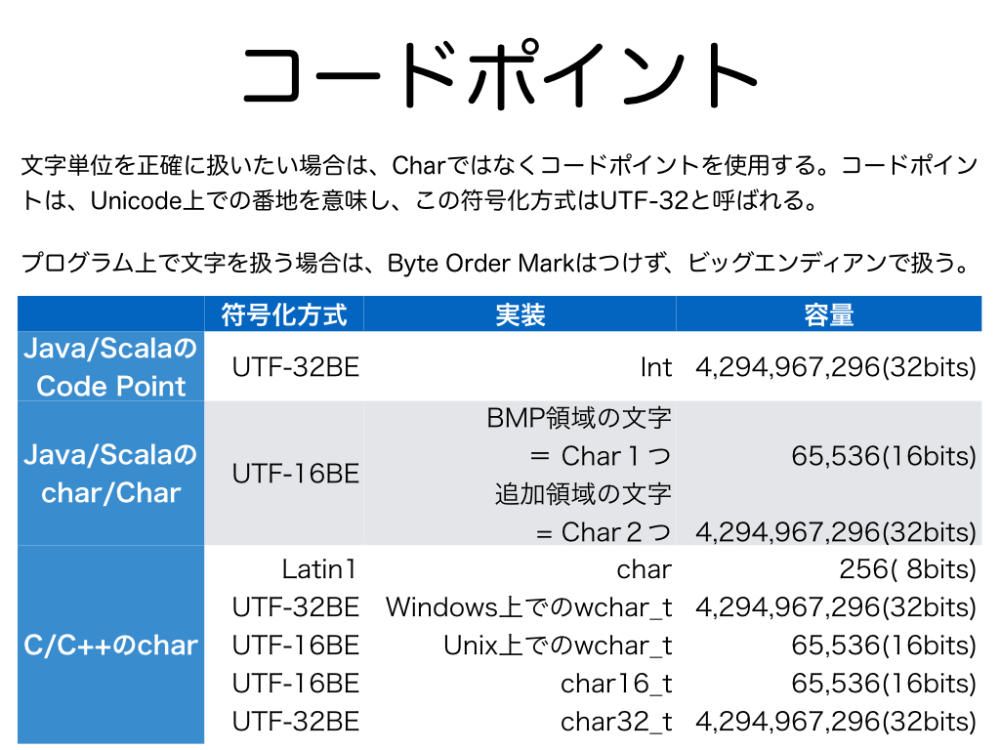
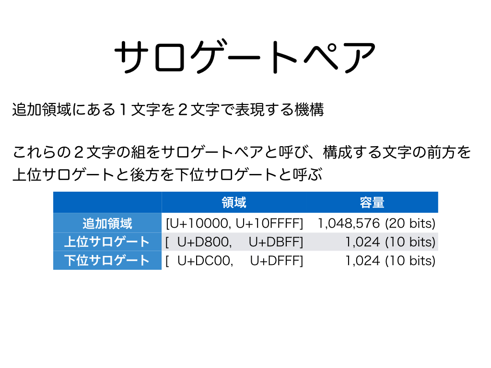
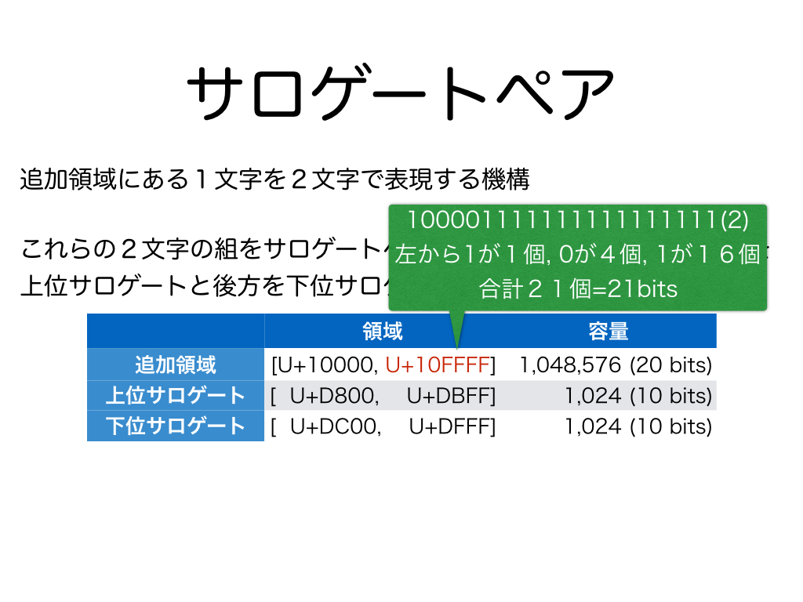
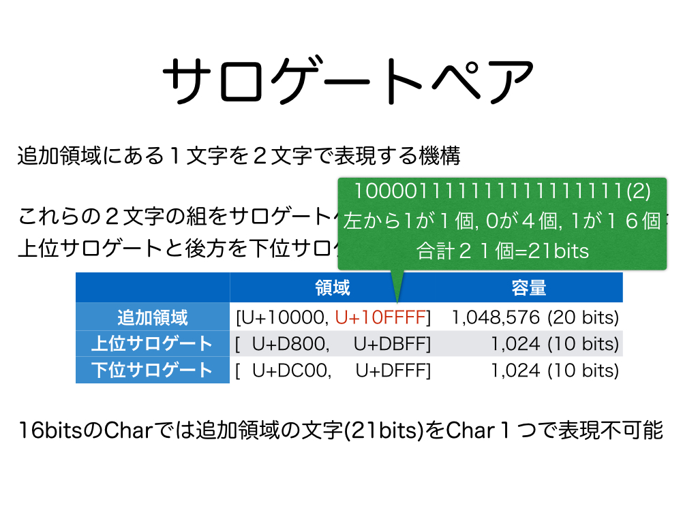
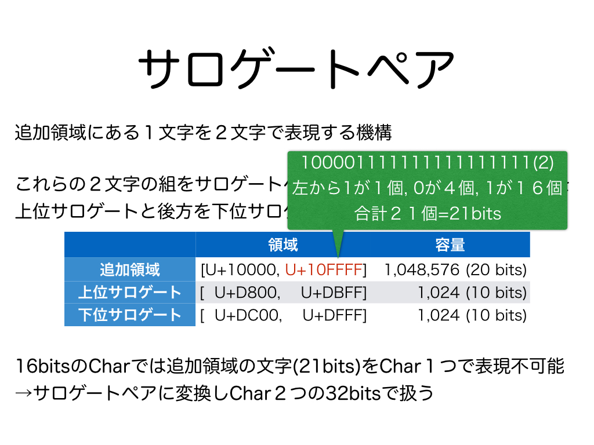
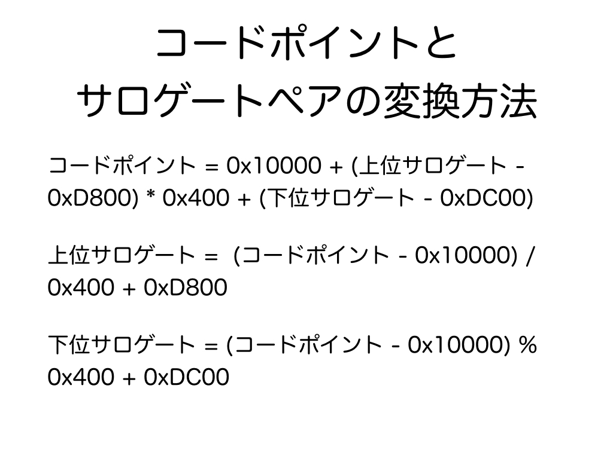

# 1.　コードポイントとサロゲートペアの理論
<h3>1.1　コードポイント</h3>
<br>
コードポイントとは、文字コード上で、文字につけられた番号のことです。Unicodeのコードポイントは<a href="https://ja.wikipedia.org/wiki/Unicode%E4%B8%80%E8%A6%A7%E8%A1%A8" target="_blank">WikipediaのUnicode一覧表のページ</a>から調べることができます。
ScalaのCharにはChar１つで表せない文字が存在するため、文字単位を正確に扱いたい場合は、Charではなくコードポイントを使用します。コードポイントの符号化方式のことを<a href="https://ja.wikipedia.org/wiki/UTF-32" target="_blank">UTF-32BE</a>と言います。
CharやStringは<a href="https://ja.wikipedia.org/wiki/UTF-16" target="_blank">UTF-16BE</a>であり、<a href="https://ja.wikipedia.org/wiki/%E5%9F%BA%E6%9C%AC%E5%A4%9A%E8%A8%80%E8%AA%9E%E9%9D%A2" target="_blank">BMP領域</a>ではChar１つで１文字、<a href="https://ja.wikipedia.org/wiki/%E8%BF%BD%E5%8A%A0%E9%9D%A2" target="_blank">追加領域</a>ではChar２つで１文字を表現します。
なお、プログラム上で文字を扱う場合は<a href="https://ja.wikipedia.org/wiki/%E3%83%90%E3%82%A4%E3%83%88%E3%82%AA%E3%83%BC%E3%83%80%E3%83%BC%E3%83%9E%E3%83%BC%E3%82%AF" target="_blank">BOM (Byte Order Mark)</a>はつけずに、一般的には<a href="https://ja.wikipedia.org/wiki/%E3%82%A8%E3%83%B3%E3%83%87%E3%82%A3%E3%82%A2%E3%83%B3" target="_blank">ビッグエンディアン</a>で扱います。実際には使用するエンディアンはプロセッサに依存して選択されるべきですが、ScalaやJavaなど<a href="https://ja.wikipedia.org/wiki/Java%E4%BB%AE%E6%83%B3%E3%83%9E%E3%82%B7%E3%83%B3" target="_blank">JVM</a>上で動く言語ではJVMの仕様により必ずビッグエンディアンで扱います。  
<br>
BOMとエンディアンについては<a href="#コラムbomとエンディアン">コラム：BOMとエンディアン</a>、UTF-8のBOMを削除する方法については<a href="#コラムutf-8のbomを削除する方法">コラム：UTF-8のBOMを削除する方法</a>、UTF-8のセキュリティ問題については<a href="#コラムutf-8のセキュリティ問題nimda">コラム：UTF-8のセキュリティ問題、Nimda</a>、UTF-8のテキストのMySQLへの保存については<a href="#コラムutf-8のテキストのmysqlへの保存utf8mb4">コラム：UTF-8のテキストのMySQLへの保存、utf8mb4</a>を参照ください。
***
<h3>1.2　サロゲートペア</h3>
<br>
追加領域ではChar２つで１文字を表現する方法のことをサロゲートペアと呼びます。ペア（２つの対）になっているCharの前方を上位サロゲート（High Surrogate）、後方を下位サロゲート（Low Surrogate）と呼びます。
<br>
<br>
BMP領域はU+0000からU+FFFFまでの領域、追加領域はU+10000からU+10FFFFまでの領域で、合わせて全容量は21bitです。
<br>
<br>
従って、Charの16bitの容量には収まりませんが、
<br>
<br>
Char２つの32bitの容量やInt１つの32bitの容量には十分に収まります。
***
<h3>1.3　コードポイントとサロゲートペアの相互変換式</h3>
<br>
このスライドに示すのがコードポイントとサロゲートペアの相互変換の計算式です。
***
<h3>コラム：BOMとエンディアン</h3>
BOMとはUnicodeで符号化した際にテキストデータの先頭につける制御記号のことです。
プロセッサの仕様により、データを４byte単位で区切った場合、先頭のbyteから順方向に読み込むのか、末尾のbyteから逆方向に読み込むのか、あるいはそれ以外の順序で読み込むのか、読み込む順序を決める必要があります。エンディアンとは４byteの読み込み順序です。先頭から順方向に読み込む場合ビッグエンディアンと言い、末尾から逆方向に読み込む場合リトルエンディアンと言います。エンディアンの違いをBOMにより復号器に認識させるか、テキストと復号器がどのエンディアンを使用するかをあらかじめ決めておく必要があります。BOMをつけてBOMでエンディアンを宣言するUTF-16のことを「UTF-16」、BOMをつけないでビッグエンディアンと決められているUTF-16のことを「UTF-16BE」、BOMをつけないでリトルエンディアンと決められているUTF-16のことを「UTF-16LE」と言います。そして、BOMをつけてBOMでエンディアンを宣言するUTF-32のことを「UTF-32」、BOMをつけないでビッグエンディアンと決められているUTF-32のことを「UTF-32BE」、BOMをつけないでリトルエンディアンと決められているUTF-32のことを「UTF-32LE」と言います。
さらに、BOMをつけてBOMでエンディアンを宣言することになっていますがBOMが存在しなかった場合はデフォルトでビッグエンディアンとして読み込むことがUnicodeで決められていますが、Windowsではリトルエンディアンとして読み込まれます。  

符号化形式（符号化スキーム）|エンディアンの区別|バイトオーダーマーク（BOM）
---|---|---
UTF-8||0xEF 0xBB 0xBF（なお日本ではBOM無しはUTF-8Nと呼ばれることがある）
UTF-16|BE|0xFE 0xFF
&nbsp;|LE|0xFF 0xFE
UTF-16BE|&nbsp;|（付加は認められない）
UTF-16LE|&nbsp;|（付加は認められない）
UTF-32|BE|0x00 0x00 0xFE 0xFF
&nbsp;|LE|0xFF 0xFE 0x00 0x00
UTF-32BE|&nbsp;|（付加は認められない）
UTF-32LE|&nbsp;|（付加は認められない）
<a href="https://ja.wikipedia.org/wiki/UTF-7" target="_blank">UTF-7</a>|&nbsp;|0x2B 0x2F 0x76 ※ （※は次のバイトの値によって異なり、0x38、0x39、0x2B、0x2Fのいずれかがくる）

エンディアン（Endian）という言葉は、ガリバー旅行記の第1部「小人国」に登場する、卵を丸い方の端から割る人々（Big Endians）と尖った方の端から割る人々 (Little Endians) に由来するようです。
***
<h3>コラム：<a href="https://ja.wikipedia.org/wiki/UTF-8" target="_blank">UTF-8</a>のBOMを削除する方法</h3>
UTF-8でのBOMはビッグエンディアンやリトルエンディアンのようなバイト順を表すものではなく特に意味がありません。
さらにプログラム上からBOM付きのUTF-8のファイルを読み込もうとするとExceptionが発生する場合があるため、一般的にはBOM無しのUTF-8で保存することが好ましいです。
一方で、Windowsのメモ帳（NotePad）でUTF-8で保存するとBOMが自動付加されることなどエディタのBOMの自動付与の問題や、加えてプロジェクトの他のメンバがBOMについて疎いこと、あるいはプロジェクトの他のメンバの性格が悪いことなどが原因で気がつかない内にUTF-8のファイルにBOMが付与されていることがあります。
そこで、UTF-8のBOMをファイルから削除する方法を２通り紹介します。
<h4>（１）<a href="https://ja.wikipedia.org/wiki/Vim" target="_blank">Vim</a>によるUTF-8のBOMの手動削除</h4>
UTF-8のBOMはVimをバイナリモードで確認し手動で除去できます。
```bash
$ vi -b src/test/resources/day3/utf8_with_bom.xml 
```
次は、バイナリモードでBOM付きのUTF-8でエンコードされたXMLファイルを開いた例です。
```xml
  1 <feff><?xml version="1.0" encoding="UTF-8" standalone="yes"?>^M
  2 <root>utf8 with bom</root>
```
先頭の```<feff>```がBOMです。この```<feff>```からもわかるようにUTF-8のBOMはUTF-16やUTF-32でビッグエンディアンを意味するU+FEFFです。U+FEFFをUTF-8でエンコードすると３bytes (＝３<a href="https://ja.wikipedia.org/wiki/%E3%82%AA%E3%82%AF%E3%83%86%E3%83%83%E3%83%88_(%E3%82%B3%E3%83%B3%E3%83%94%E3%83%A5%E3%83%BC%E3%82%BF)" target="_blank">octets</a>)になり16進数で表すと"0xEF 0xBB 0xBF"です。
<h4>（２）ScalaによるUTF-8のBOMの自動削除</h4>
一々BOMがついていないかをVimでUTF-8のファイルを開いて確認し、手動で削除する作業は大変です。
BOM付きのファイルをScala上から開く際にファイルにBOMが存在していたらBOMを自動的に削除（スキップ）させる方法について説明します。
例えば、上記のBOM付きUTF-8のXMLファイルをJavaの標準ライブラリにある<a href="http://docs.oracle.com/javase/jp/8/docs/api/org/w3c/dom/package-summary.html" target="_blank">org.w3c.dom</a>のDOMパーサで開いた場合Exceptionが発生します。InputStreamをサンプルコードのskipUTF8BOMメソッドに通すことでファイルの先頭のBOMをスキップした位置からファイルを読み込むことができるため、これによりBOMによるExceptionを回避できます。そして、このようにskipUTF8BOMメソッドに一度通して取得したデータを保存したファイルには意図しない限りUTF-8のBOMは付与されません。毎回UTF-8のファイルを開く際にskipUTF8BOMメソッドを通すことはBOMが入り込まないことが保証されているか入り込んでも問題ないことが保証されている場合は余計な処理ですが、そうではない場合は多少のオーバーヘッドを払ってでもskipUTF8BOMメソッドを通すことでBOMに対する安全対策を施しておくと安心です。なお、Scalaのscala.xmlのパーサはBOM付きのUTF-8のXMLファイルを入力してもExceptionは発生しません。org.w3c.domはJavaの標準ライブラリにありますが、scala.xmlは現在は標準ライブラリにはありませんのでScalaとは別途にインストールが必要です。本リポジトリでは<a href="http://www.scala-sbt.org/" target="_blank">SBT</a>を実行するとscala.xmlが自動的にインストールされます。
```scala
  private val input: Path = Paths.get("..", "..", "src", "test", "resources", "day3", "utf8_with_bom.xml")

  @Test
  def testW3CDOMForUTF8BOM(): Unit = {
    //val inputStreamWithBOM: InputStream = Files.newInputStream(input)
    val inputStreamWithoutBOM: InputStream = skipUTF8BOM(Files.newInputStream(input), StandardCharsets.UTF_8)

    //org.w3c.dom
    val dbf = DocumentBuilderFactory.newInstance()
    val db = dbf.newDocumentBuilder()
    //val doc = db.parse(inputStreamWithBOM)
    //java.nio.channels.ClosedChannelException
    val doc = db.parse(inputStreamWithoutBOM)
    val rootElemInDOM = doc.getDocumentElement

    assert(rootElemInDOM.getTextContent == "utf8 with bom")
  }

  @Test
  def testScalaXMLForUTF8BOM(): Unit = {
    val inputStreamWithBOM: InputStream = Files.newInputStream(input)
    
    //scala.xml
    val rootElemInScalaXML = XML.load(inputStreamWithBOM)

    assert(rootElemInScalaXML.text == "utf8 with bom")
  }

  private def skipUTF8BOM(inputStream: InputStream, encoding: Charset): InputStream = {
    if (encoding != StandardCharsets.UTF_8) {
      return inputStream
    }
    val bom: Array[Byte] = Array(0xEF, 0xBB, 0xBF).map(_.toByte)
    val bomSize: Int = bom.length
    val is: InputStream = {
      if (inputStream.markSupported()) {
        inputStream
      } else {
        new BufferedInputStream(inputStream)
      }
    }
    is.mark(bomSize)
    if (bomSize <= is.available()) {
      def hasBom(threeBytes: Array[Byte]): Boolean = {
        (threeBytes.length == bomSize) && (threeBytes sameElements bom)
      }
      val buffer: Array[Byte] = new Array[Byte](bomSize)
      is.read(buffer, 0, bomSize)
      if (!hasBom(buffer)) {
        is.reset()
      }
    }
    is
  }
```
***
<h3>コラム：UTF-8のセキュリティ問題、Nimda</h3>
UTF-8の１文字の構造を正規表現で表すと次になる。  
BOM（UTF-8では、byte orderは１通りなのでBOMは不要、付加するかは任意）：
```java
\\xEF\\xBB\\xBF//ビッグエンディアンの0xFEFFをUTF-8エンコーディングするとこの3バイトになる。  
```
文字：  
```java
(  
                                                         [\\x00-\\x7F]|//1バイト文字  
                                            [\\xC2-\\xDF][\\x80-\\xBF]|//2バイト文字  
                                       \\xE0[\\xA0-\\xBF][\\x80-\\xBF]|//3バイト文字  
                               [\\xE1-\\xEF][\\x80-\\xBF][\\x80-\\xBF]|//3バイト文字  
                          \\xF0[\\x90-\\xBF][\\x80-\\xBF][\\x80-\\xBF]|//4バイト文字  
                  [\\xF1-\\xF7][\\x80-\\xBF][\\x80-\\xBF][\\x80-\\xBF]|//4バイト文字  
             \\xF8[\\x88-\\xBF][\\x80-\\xBF][\\x80-\\xBF][\\x80-\\xBF]|//5バイト文字  
     [\\xF9-\\xFB][\\x80-\\xBF][\\x80-\\xBF][\\x80-\\xBF][\\x80-\\xBF]|//5バイト文字  
\\xFC[\\x84-\\xBF][\\x80-\\xBF][\\x80-\\xBF][\\x80-\\xBF][\\x80-\\xBF]|//6バイト文字  
\\xFD[\\x80-\\xBF][\\x80-\\xBF][\\x80-\\xBF][\\x80-\\xBF][\\x80-\\xBF] //6バイト文字  
)  
```
UTF-8のエンコードの問題で同じ文字を別のバイト数のバイト列で表現できます。例えば、パスの区切り文字として使われる「/」（0x2F）を「0xC0 0xAF」や「0xE0 0x80 0xAF」や「0xF0 0x80 0x80 0xAF」や「0xF8 0x80 0x80 0x80 0xAF」や「0xFC 0x80 0x80 0x80 0x80 0xAF」で表現できてしまいます。これにより本来であれば検査で引っかかるはずが、検査がUTF-8の表現の冗長性を想定していないと別のバイト列で表現されているために検査が通ってしまう問題が生じます。このUTF-8の冗長性による穴をついたウイルスがNimda（adminの逆さ文字）です。
現在のUTF-8の仕様では同じ文字を表すバイト列の内、最小のバイト列以外は不正であるとして解釈しないことになっています。
***
<h3>コラム：UTF-8のテキストのMySQLへの保存、utf8mb4</h3>
UTF-8の1バイト文字（容量は7bit）はUS-ASCIIと互換性が保たれています。
1から3バイト文字（容量は16bit）でUnicodeのBMP領域にある文字は表現できます。
1から4バイト文字（容量は21bit）でUnicodeの追加領域を含む全ての文字を表現できます。
1から6バイト文字の容量は31bitで、5バイト・6バイト文字は、Unicodeで定義されないがIETFで定義される文字のために設計されましたが現在は不正な文字となっています。
従って、UTF-8でUnicodeの追加領域にある文字も含む全ての文字に対応するためには４バイト必要です。
ところが、MySQLのutf8は３バイト文字までしか格納できず、４バイト文字は格納すると全て「?」になってしまいます。４バイト文字もMySQLに格納するためにはutf8mb4を使用する必要がありますが、utf8mb4はMySQL5.5.3から導入されたので、それ以前のバージョンには存在しません。どうしてもMySQLのバージョンをあげることが難しい場合は、byte配列として格納するかwindows-31j (cp932, ms932)として格納する必要があります。
